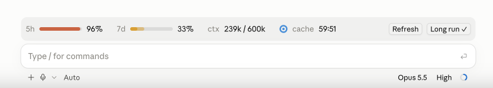

# Long Live the Claude

> 非官方的 Claude Code 社区插件，与 Anthropic 无关，也未经其认可。

[English](README.md) | 简体中文

*Long live the king, and long live the Claude.* 这个插件让长时间运行的 Claude Code 会话一直活着：它把额度用量直接显示出来；在空闲间隙让提示缓存保持有效；在 5 小时额度快用完时让模型收尾、暂停会话，等额度重置后再把会话唤醒。



## 为什么需要它

现在的旗舰模型已经可以不靠 `/loop` 自主工作好几个小时：一个很长的回合、若干后台任务、任务完成时的通知再把模型叫醒。想让一个会话跑上一整天，会遇到两个障碍。

1. **5 小时额度窗口。** 用量超过 100% 以后，Claude Code 会不断提醒模型停下；如果继续工作，消耗会记到周额度上。而等额度重置后，没有任何机制会把会话重新叫起来。
2. **提示缓存会过期。** 订阅用户的缓存有效期是 1 小时。空闲超过 1 小时后，下一个请求要为整段上下文重建缓存，价格是输入原价的 2 倍。

## 它做了什么

**输入框上方的用量条**

- `5h` 和 `7d`：两个额度窗口各还剩多少。进度条里半透明的那一段，是按当前速度在重置前会用掉的部分。
- `ctx`：当前上下文相对于自动压缩窗口的用量，和 `/context` 的口径一致。
- `cache`：一个圆环加倒计时，表示提示缓存还有多久过期。
- 点一下用量条可以展开细节：每个窗口何时重置、按当前速度会不会提前用完、离自动压缩还有多少余量，以及保温状态。

**长程模式**（按对话开启，默认关闭；点 `Long run` 按钮或使用 `/long-run`）

- **空档保温。** 在缓存快过期前约 3 分钟，插件发一个极小的请求，读一遍已缓存的上下文，把缓存有效期续上。它覆盖所有空档：你离开电脑、模型在等后台任务、额度暂停期间。
- **在 5 小时额度到 95% 时平稳暂停。** 模型拿到的下一个工具结果后面会附一条 system reminder，告诉它额度快到了、几点重置，请在当前这一步告一段落后结束本轮。插件不要求模型写笔记或存档：对模型来说，暂停只是两条消息之间的一段空白。
- **通知暂存，不会丢。** 暂停期间，后台任务的通知和定时触发不会开启新回合。它们的原文会被保存下来，唤醒时一并交给模型。你自己输入的内容照常进入会话。
- **自动唤醒。** 额度重置两分钟后，插件提交一条提示，告诉模型暂停了多久，并附上暂存的通知。因为缓存一直保温，唤醒后的第一个请求很便宜。
- **重启后继续。** 开关状态和进行中的暂停按对话保存，app 重启或恢复会话后会接着之前的状态继续。

## 成本账

以订阅用户的 1 小时缓存为例：

| | 成本（以"整段上下文按输入原价读一遍"为 1 个单位） |
| --- | --- |
| 保温一次（缓存命中） | 1/20 = 0.05 |
| 缓存过期后重建 | 2 |

大约每 57 分钟保温一次，所以 **约 40 次保温（约 38 小时）才抵得上重建一次**。因此长程模式会一直保温，直到对话连续空闲满 36 小时为止，每次真正的请求都会重新计时。一次最长 5 小时的额度暂停，大约需要保温 5 次，合计 0.25 个单位，而重建一次是 2 个单位。

这也是选在 95% 而不是 100% 暂停的原因：会话在开始消耗超额额度之前就停下了。

## 安装

要求：

- Claude Code **2.1.286** 或更新版本（支持 function hooks 插件）。
- `5h` / `7d` 读数和额度暂停需要 Claude 订阅（Pro 或 Max）。使用 API key 时，用量条只显示上下文和缓存，保温功能照常可用。

通过插件市场安装：

```
/plugin marketplace add Lapis0x0/long-live-the-claude
/plugin install long-live-the-claude@long-live-the-claude
```

或者从本地克隆加载：

```bash
claude --plugin-dir /path/to/long-live-the-claude
```

## 使用

- **`Long run`**：为当前对话开启长程模式；开启后按钮显示为 `Long run ✓`。
- **`Refresh`**：立刻保温一次。

| 命令 | 作用 |
| --- | --- |
| `/long-run` 或 `/long-run on` | 开启长程模式 |
| `/long-run off` | 关闭长程模式；如果正在暂停，会立刻结束暂停，并把暂存的通知交给模型 |
| `/long-run test` | 立刻保温一次，并报告缓存命中情况 |
| `/long-run sim <分钟>` | 模拟额度刚过 95%、`<分钟>` 后重置，用来完整观察一次暂停和唤醒 |
| `/long-run debug <分钟>` | 改成每 `<分钟>` 保温一次，而不是每小时一次，用于测试 |

## 参数

阈值是 [`hooks/register.tsx`](hooks/register.tsx) 开头的常量：

| 常量 | 默认值 | 含义 |
| --- | --- | --- |
| `PAUSE_AT` | `95` | 5 小时窗口用到多少百分比时开始收尾 |
| `WAKE_DELAY_MS` | 2 分钟 | 额度重置后再等多久唤醒会话 |
| `IDLE_CAP_MS` | 36 小时 | 对话连续空闲多久后停止保温 |
| `TTL_MS` | 1 小时 | 假定的缓存有效期；如果保温请求没命中缓存，会自动停止保温 |

## 开发

```bash
git clone https://github.com/Lapis0x0/long-live-the-claude
cd long-live-the-claude
claude --plugin-dir .
```

在这个会话里运行 `/plugin-types`，插件 API 的类型声明会写进 `.claude/types`。之后用 `tsc -p tsconfig.json` 做类型检查，用 `claude plugin validate .claude-plugin/plugin.json` 按 Claude Code 加载插件的方式检查一遍。

## 许可证

[MIT](LICENSE)
